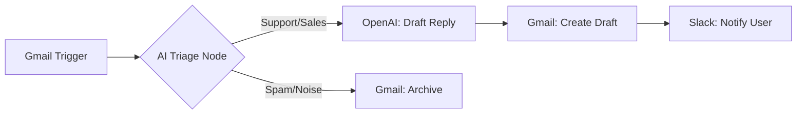

# Automated Email Triage & Draft Generator

This repository contains an n8n workflow designed to automatically monitor a Gmail inbox, evaluate incoming messages using an LLM, and generate draft replies for human review. It streamlines inbox management by categorizing emails into actionable buckets (Support, Sales, Spam) and preparing contextual responses.

### Architecture Diagram

### Business Impact
* **Time Saved:** Eliminates manual reading and sorting of routine inquiries.
* **Faster Response Times:** Has a contextual draft ready for review the moment an email is received.
* **Accuracy:** Uses strict AI system prompts to ensure responses remain polite, concise, and brand-aligned without hallucinating information.

### Setup Instructions
1. Import the `workflow.json` file into your n8n instance.
2. Configure your Google OAuth2 credentials to enable the Gmail API trigger and draft actions.
3. Connect your preferred LLM (e.g., OpenAI, Anthropic, or a local Ollama instance).
4. Update the system prompts in the LLM nodes to match your specific business context and desired tone.
