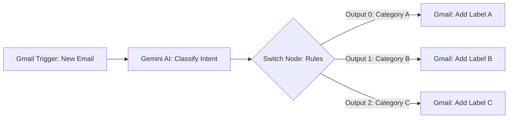

# Automated AI Email Classifier & Triage (n8n + Gemini)

An automated n8n pipeline that listens for incoming Gmail messages, evaluates their content and intent using Google Gemini, and dynamically organizes the inbox by applying specific Gmail labels via a multi-branch Switch routing system.

---

## Architecture Diagram

---

## How It Works

1. **Gmail Trigger:** Watches for unread incoming messages and extracts the sender, subject line, and body.
2. **Message a Model (Gemini):** Analyzes the message context against predefined categories (e.g., *Support*, *Inquiries/Sales*, *Spam/Urgent*) and outputs a clean classification label.
3. **Switch Node:** Routes the message execution flow into distinct output branches (`0`, `1`, `2`) based on the classification returned by the AI.
4. **Add Label to Message:** Connects back to Gmail to apply the corresponding label automatically, keeping the inbox organized without manual sorting.

---

## Tech Stack & Nodes

* **Orchestration:** [n8n](https://n8n.io/)
* **AI Engine:** Google Gemini (`Message a model` node)
* **Email Provider:** Gmail API (OAuth2)
* **Logic Routing:** n8n Switch Node (Rules Mode)

---

## Setup & Deployment

1. **Import Workflow:** Download [`workflow.json`](./workflow.json) and import it into your n8n canvas (`Workflows` > `Import from File`).
2. **Configure Credentials:**
   * Set up **Gmail OAuth2** credentials in n8n (requires Gmail API enabled in Google Cloud Console).
   * Set up your **Google AI / Gemini API** credentials.
3. **Customize Labels:**
   * Open each **Add label to message** node.
   * Select your desired Gmail labels for each respective branch.
4. **Activate:** Toggle the workflow status to **Published / Active**.
